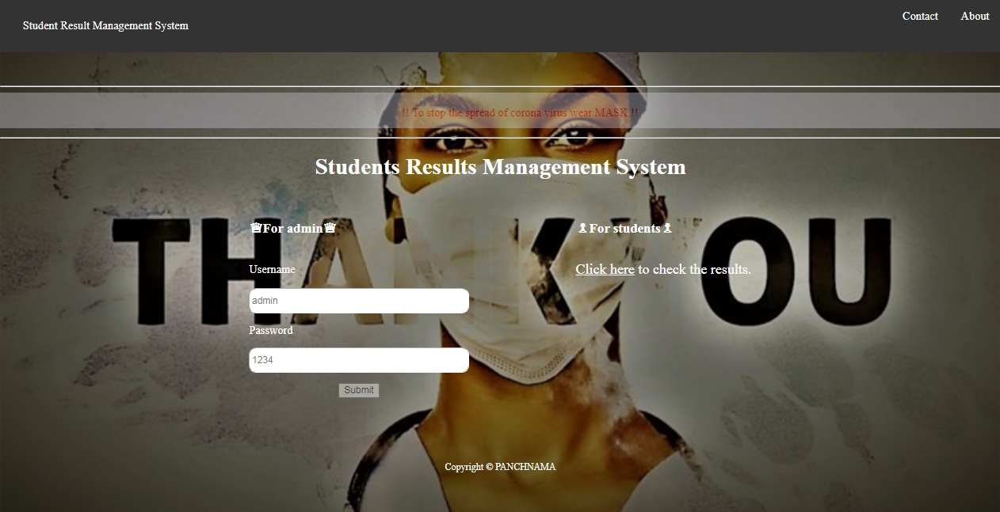
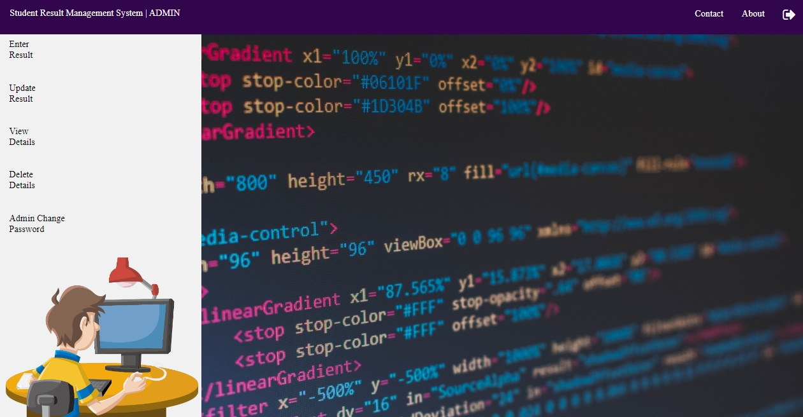
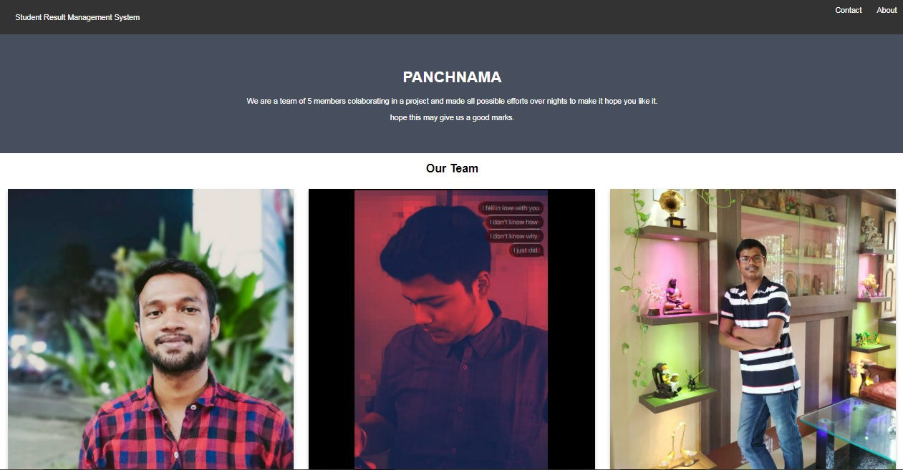
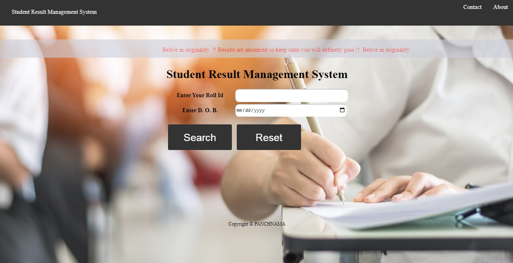

<h1 align="center">Welcome to Result Management System 👋</h1>
 

## ❓ What is this project about?

This project is focused on building an online portal of [STUDENT RESULT MANAGEMENT SYSTEM](http://result-board.infinityfreeapp.com/rms/index.php) directed to easier the management work of publishing results.

## :computer: Project Development:
  - Backend: [PHP]
  - Frontend: [HTML, CSS3, JS]
  - DataBase: [mySQL]
  - Software: [chrome, XAMPP, sublime]

## :camera_flash: Screenshots
* Home

  Acknowledgement: [Mayank Mohak](https://github.com/mayankmohak)
  
* Admin Panel

* About

* ContactUs

  Want to use this project mail us at mayank8199@gmail.com

* Students view page

## :lock_with_ink_pen: Login Details for admin 
  - User name: admin
  - password: 1234
  
## :computer: How to run this Project
  - Download and Unzip file on your local system copy 'rms' folder.
  - Put rms folder inside root directory-(C:\xampp\htdocs)
  
## :gear: Database Configuration
  - Open phpmyadmin
  - Create Database rms
  - Import database rms.sql (available inside zip package)
  
## :clapper: STEPS TO VIEW THE PROJECT:
  - Open Your browser link - “http://localhost/rms”
  - User name: admin
  - password: 1234
  
## 🤝 Contributing
Comments and improvements are more than welcome!

Feel free to fork and open a pull request.
>note: please open an issue before making pr as a good practice of open source.

## 🙌 Show your support

Give a ⭐️ if you liked this work!

